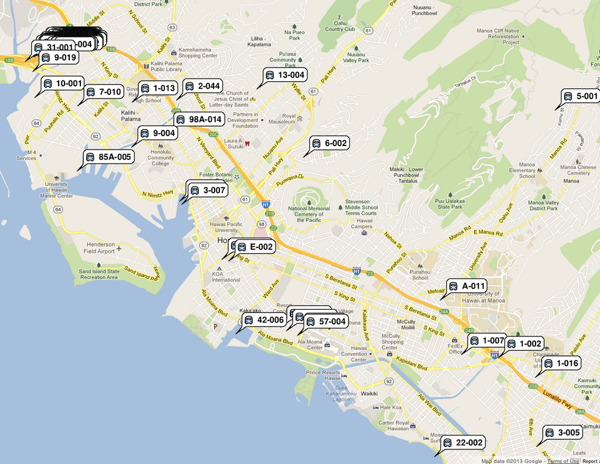

hibus
=====

Implemented Firebase's [Firebus Demo](https://github.com/firebase/firebus/tree/gh-pages) with Honolulu's TheBus tracking system, using NodeJS to fetch data from the city's servers and update Firebase, allowing users to track Honolulu's busses in realtime.

